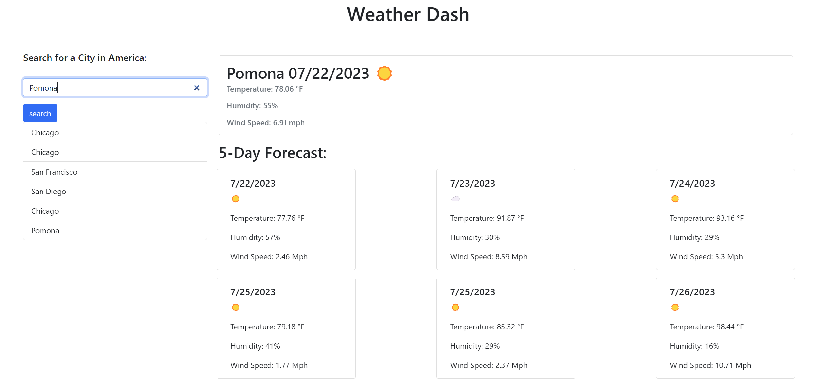

# Weather Dash

  

  ## Table-of-Contents

  * [Description](#description)
  * [Installation](#installation)
  * [Usage](#usage)
  * [License](#license)
  * [Contributing](#contributing)
  * [Tests](#tests)
  * [Questions](#questions)
  
  ## [Description](#table-of-contents)

  This is an application that gives you a 5-day weather forecast based on what city you input in the search bar.

  ## [Installation](#table-of-contents)

  There is no installation required! Just direct yourself to the Github Pages link below!

  ## [Usage](#table-of-contents)

  Simply type in the city that you would like to view the 5-day weather forecast of.

  [Deployment Link](https://info-hazard.github.io/weather-dash/)

  
  
  ## [License](#table-of-contents)
  The application is covered under the following license: [mit](https://choosealicense.com/licenses/mit)

  ## [Contributing](#table-of-contents)
  
  Made using OpenWeather API and Bootstrap.

  ## [Tests](#table-of-contents)

  To test my app just search for any U.S. City!

  ## [Questions](#table-of-contents)

  Please contact me using the following links:

  [GitHub](https://github.com/info-hazard)

  [Email: zachakazach@gmail.com](mailto:zachakazach@gmail.com)
